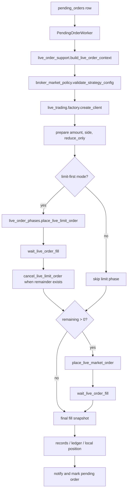

# Backend Architecture

This backend is organized around thin HTTP routes, service modules, and a
small live-trading domain model. The goal is to keep exchange-specific quirks
at the edge and keep strategy/order workflows testable without real API keys.

## Module Boundaries

```text
backend_api_python/
├─ app/routes/                    HTTP boundary
├─ app/services/
│  ├─ live_trading/               exchange clients, contracts, capabilities
│  ├─ pending_orders/             live pending-order workflow pieces
│  ├─ grid/                       grid runtime, resting orders, fill sync
│  ├─ broker_market_policy.py     broker x market compatibility
│  ├─ pending_order_worker.py     queue consumer and workflow orchestration
│  ├─ trading_executor.py         realtime strategy loop
│  └─ backtest.py                 historical simulation
├─ tests/fixtures/exchanges/      API-key-free exchange contracts
├─ scripts/                       smoke tests and quality guardrails
└─ docs/                          architecture and operating notes
```

- `app/routes/`: HTTP input/output only. Routes should parse requests, call a
  service, and return JSON. Do not add exchange-specific order logic here.
- `app/services/live_trading/`: exchange clients, live order contracts,
  capability matrix, position parsing, sizing, and execution helpers.
- `app/services/grid/`: grid bot runtime, resting-order placement, fill
  polling, fill unit conversion, and ledger reconciliation.
- `app/services/pending_orders/`: small services for pending-order execution,
  including live order context loading, notification, id generation, direction
  mapping, fill accumulation, and exchange-specific live order phases.
- `app/services/pending_order_worker.py`: queue consumer for pending orders.
  This file is a legacy hot spot. Prefer extracting small services instead of
  adding new exchange branches directly.
- `app/services/trading_executor.py`: realtime strategy loop. This is also a
  legacy hot spot. Prefer moving new behavior into narrow helpers with tests.
- `app/data_sources/`: market data adapters. Data-source failures should be
  explicit enough for operators to diagnose.
- `app/utils/`: infrastructure helpers only, such as auth, DB, logging, and
  time handling.

## Live Order Flow



The worker owns orchestration and failure semantics. `pending_orders/`
contains reusable live-order building blocks. Exchange parameter differences
belong in `live_order_phases.py`; they should not leak back into routes or the
main worker.

## Exchange Contract Tests

```text
tests/fixtures/exchanges/
├─ order_fill_contracts.json      normalized fill status, qty, avg price, fee
└─ position_contracts.json        normalized long/short size and entry price

scripts/exchange_smoke_test.py --offline-contracts
```

These fixtures are the local substitute for real API keys. They let us check
Binance, OKX, Bitget, Bybit, Gate, HTX, Coinbase, and Kraken behavior before
touching live credentials.

## Live Trading Single Sources Of Truth

- Supported crypto venues live in
  `app/services/live_trading/capabilities.py`.
- Broker/market compatibility lives in
  `app/services/broker_market_policy.py`.
- Stable order domain objects live in
  `app/services/live_trading/contracts.py`.
- Exchange fill/position fixtures live under
  `tests/fixtures/exchanges/`.

When adding or removing an exchange, update the capability matrix first. Other
modules should read from it rather than copying string lists.

## Exchange Integration Checklist

1. Add or update the REST client under `app/services/live_trading/`.
2. Add the venue to `capabilities.py` with supported `spot` / `swap` market
   types.
3. Add order-fill fixtures in `tests/fixtures/exchanges/order_fill_contracts.json`.
4. Add position fixtures in `tests/fixtures/exchanges/position_contracts.json`
   when the venue supports derivatives.
5. Add order parameter contract tests in
   `tests/test_exchange_order_param_contracts.py`.
6. Run:

```bash
python scripts/exchange_smoke_test.py --offline-contracts
python scripts/backend_quality_check.py
pytest -p no:cacheprovider tests/test_live_trading_capabilities.py
```

Live API tests must stay opt-in and read-only by default. Any real order test
must require both `--allow-orders` and `EXCHANGE_SMOKE_ALLOW_ORDERS=1`.

## Refactoring Rules

- Do not add new large `isinstance(client, ExchangeClient)` blocks in routes.
- Do not add new exchange support by only patching `pending_order_worker.py`.
- Do not swallow trading-core exceptions with `except Exception: pass`; mark the
  order failed, log enough context, or document why the exception is safe.
- Keep fixtures updated before touching live trading paths.
- Prefer small pure parsers for response normalization; they are easy to test
  and do not need API keys.

## Known Legacy Hot Spots

The quality baseline intentionally tracks these files so future changes do not
make them worse:

- `app/services/trading_executor.py`
- `app/services/pending_order_worker.py`
- `app/services/backtest.py`
- `app/routes/quick_trade.py`
- `app/routes/strategy.py`

The long-term direction is to split these into workflow services, phase
objects, and exchange adapters while preserving the existing test suite.
