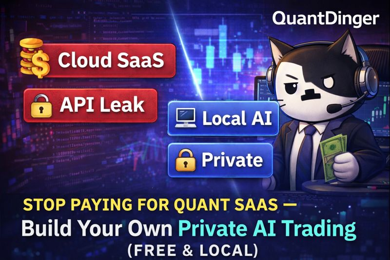
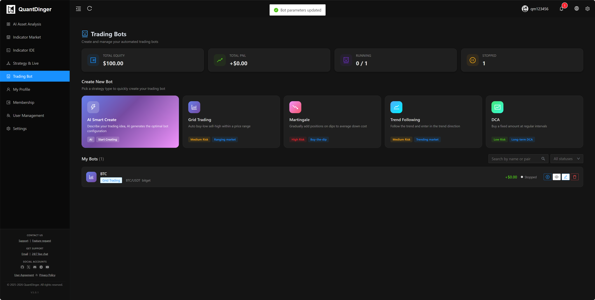
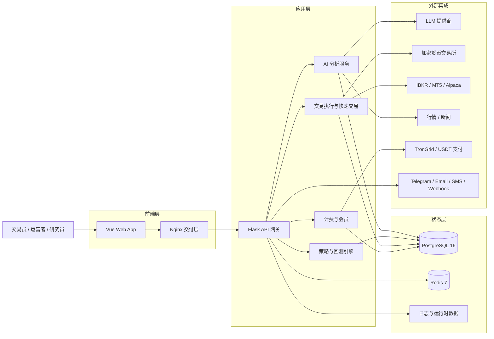

<div align="center">
  <a href="https://github.com/brokermr810/QuantDinger">
    
  </a>

  <h1>QuantDinger</h1>
  <h3>开源 AI 量化交易基础设施层</h3>
  <p><strong>将交易想法变成 Python 策略、回测、模拟盘与实盘——全部在一套自托管栈中完成。</strong></p>
  <p><em>AI 研究 → 策略代码 → 回测 → 模拟/实盘执行 → 监控</em></p>

  <div align="center" style="max-width: 680px; margin: 1.25rem auto 0; padding: 20px 22px 22px; border: 1px solid #d1d9e0; border-radius: 16px;">
    <p style="margin: 0 0 14px; line-height: 1.65;">
      <a href="../README.md"><strong>English</strong></a>
      <span style="color: #afb8c1;"> · </span>
      <a href="README_CN.md"><strong>简体中文</strong></a>
      <span style="color: #afb8c1;"> · </span>
      <a href="README_JA.md"><strong>日本語</strong></a>
      <span style="color: #afb8c1;"> · </span>
      <a href="README_KO.md"><strong>한국어</strong></a>
      <span style="color: #afb8c1;"> · </span>
      <a href="README_TH.md"><strong>ไทย</strong></a>
      <span style="color: #afb8c1;"> · </span>
      <a href="README_VI.md"><strong>Tiếng Việt</strong></a>
      <span style="color: #afb8c1;"> · </span>
      <a href="README_AR.md"><strong>العربية</strong></a>
    </p>
    <p style="margin: 0 0 18px; padding-bottom: 16px; border-bottom: 1px solid #eaeef2; line-height: 2;">
      <a href="https://ai.quantdinger.com"><strong>SaaS</strong></a>
      <span style="color: #d8dee4;"> &nbsp;·&nbsp; </span>
      <a href="api/README.md"><strong>API 文档</strong></a>
      <span style="color: #d8dee4;"> &nbsp;·&nbsp; </span>
      <a href="https://www.youtube.com/watch?v=tNAZ9uMiUUw"><strong>视频演示</strong></a>
      <span style="color: #d8dee4;"> &nbsp;·&nbsp; </span>
      <a href="https://www.quantdinger.com"><strong>官网</strong></a>
      <span style="color: #d8dee4;"> &nbsp;·&nbsp; </span>
      <a href="https://aws.amazon.com/marketplace/pp/prodview-naanrb7d2mbc6"><strong>AWS Marketplace</strong></a>
    </p>
    <p style="margin: 0; line-height: 2;">
      <a href="https://t.me/quantdinger"></a>
      &nbsp;
      <a href="https://discord.com/invite/tyx5B6TChr"></a>
      &nbsp;
      <a href="https://youtube.com/@quantdinger"></a>
      &nbsp;
      <a href="https://x.com/QuantDinger_EN"></a>
    </p>
  </div>

  <p style="margin-top: 1.45rem; margin-bottom: 10px;">
    <a href="../LICENSE"></a>
    
    
    
    
    
    
    
  </p>
  <p style="margin: 10px 0 12px;">
    <a href="https://aws.amazon.com/marketplace/pp/prodview-naanrb7d2mbc6"></a>
  </p>
  <p style="margin: 12px 0 10px;">
    <a href="https://oosmetrics.com/repo/brokermr810/QuantDinger"></a>
  </p>
  <p style="margin-top: 14px;">
    <a href="https://www.producthunt.com/products/quantdinger/launches/quantdinger?embed=true&amp;utm_source=badge-featured&amp;utm_medium=badge&amp;utm_campaign=badge-quantdinger" target="_blank" rel="noopener noreferrer"></a>
  </p>
</div>

---

## 目录

[两分钟试用](#两分钟试用) · [为什么选择 QuantDinger](#为什么选择-quantdinger) · [安全模型](#安全模型) · [技术亮点](#技术亮点) · [相关仓库](#相关仓库) · [MCP 与 Agent 网关](#mcp-agent-gateway) · [产品概览](#产品概览) · [功能一览](#功能一览) · [视觉导览](#视觉导览) · [架构](#架构) · [安装](#安装与首次运行) · [文档](#文档导航) · [常见问题](#常见问题) · [许可](#许可与商业说明)

---

## 两分钟试用

> **最快路径：一行命令。** 无需 `git clone`、无需 `npm`、无需 Vue 源码树。GHCR 预构建镜像；`SECRET_KEY` 在后端首次启动时自动生成。

**前置条件：** [Docker](https://docs.docker.com/get-docker/) + Compose v2（Windows/macOS 用 Docker Desktop）。**不需要 Node.js**。

```bash
curl -fsSL https://raw.githubusercontent.com/brokermr810/QuantDinger/main/install.sh | bash
```

默认安装到 `~/quantdinger`（自定义：`… | bash -s -- /opt/quantdinger`）。重复执行同一命令可拉取最新镜像并重启。

然后打开 **`http://localhost:8888`**，使用 **`quantdinger` / `123456`** 登录，并**修改默认管理员密码**。

<details>
<summary><b>Windows、手动克隆或镜像加速排错</b></summary>

**Windows（PowerShell）** —— `git clone` 后目录名为 **`QuantDinger`**：

```powershell
git clone https://github.com/brokermr810/QuantDinger.git
Set-Location QuantDinger
Copy-Item backend_api_python\env.example -Destination backend_api_python\.env
$key = & python -c "import secrets; print(secrets.token_hex(32))" 2>$null
if (-not $key) { $key = & py -c "import secrets; print(secrets.token_hex(32))" 2>$null }
(Get-Content backend_api_python\.env) -replace '^SECRET_KEY=.*$', "SECRET_KEY=$key" | Set-Content backend_api_python\.env -Encoding utf8
docker compose pull
docker compose up -d
```

**标准克隆（macOS / Linux）：**

```bash
git clone https://github.com/brokermr810/QuantDinger.git && cd QuantDinger && cp backend_api_python/env.example backend_api_python/.env && chmod +x scripts/generate-secret-key.sh && ./scripts/generate-secret-key.sh && docker compose pull && docker compose up -d
```

**`docker pull` 很慢（国内 / VPN）：** 在仓库根目录 `.env` 增加 `IMAGE_PREFIX=docker.m.daocloud.io/library/`，或配置 **Docker Desktop → Proxies**。

</details>

更多步骤与排错见 **[安装与首次运行](#安装与首次运行)**。

---

## 为什么选择 QuantDinger

| 传统做法 | QuantDinger |
|----------|-------------|
| ChatGPT 只生成代码 | 在同一栈里运行、回测并执行策略 |
| TradingView + Jupyter + 交易所 bot 各自为政 | 从研究到执行，一套自托管栈 |
| SaaS 平台托管你的 API 密钥 | 用户自有部署——你的基础设施，你的密钥 |
| AI Agent 无 scope、无审计 | 带 scope 的 Agent Gateway、默认仅纸面、审计日志 |

QuantDinger 是**可自托管、本地优先**的量化基础设施层——不是带买入按钮的聊天机器人。它在同一套生产级栈里统一 **多 LLM 研究**、**Python 原生策略引擎**、**服务端回测** 与 **多券商实盘**（10+ 加密货币 venue、IBKR、MT5、Alpaca），完全由你掌控。

## 安全模型

- **Agent token 默认仅纸面** —— 实盘交易需服务端显式解锁。
- **实盘执行需明确授权** —— token scope + 自托管栈上的 `AGENT_LIVE_TRADING_ENABLED`。
- **交易所密钥留在用户自己的部署内** —— 自托管安装不由 QuantDinger SaaS 运营方持有。
- **每次 Agent 调用写入审计日志** —— 供自动化与合规审查的 append-only 审计链。
- **QuantDinger 不提供投资建议** —— 软件仅用于合法的研究与执行；合规与风险由你自行负责。

## API 文档

| 资源 | 链接 |
|------|------|
| 人类 Web API（OpenAPI） | [`api/openapi.yaml`](api/openapi.yaml) |
| ReDoc 浏览（需 HTTP 服务） | [`api/index.html`](api/index.html) —— 在 `docs/api/` 下运行 `python -m http.server` |
| 约定（认证、响应封装） | [`API_CONVENTIONS.md`](API_CONVENTIONS.md) |
| Agent Gateway | [`agent/agent-openapi.json`](agent/agent-openapi.json) |

---

<div align="center">
  
  <p><sub><em>从零到跑通——图表、AI 研究与策略工作流，几分钟搞定。</em></sub></p>
</div>

<div align="center">
  
  <p><sub><em>闭环：<strong>AI 研究 → 策略代码 → 回测 → 模拟/实盘执行 → 监控</strong>——行情进，审计订单出。</em></sub></p>
</div>

## 技术亮点

| | QuantDinger 的差异化 |
|---|---------------------|
| **全栈量化 OS** | 图表、指标 IDE、AI 研究、回测、实盘机器人、快速交易、券商账户管理——一个产品，一个 Postgres 状态库。 |
| **Agent 原生** | 一等公民 **Agent Gateway**（`/api/agent/v1`）+ PyPI 上的 **[`quantdinger-mcp`](https://pypi.org/project/quantdinger-mcp/)**——Cursor、Claude Code、Codex 可读行情、跑回测、下单（默认纸面），全链路审计。 |
| **双策略运行时** | **`IndicatorStrategy`**（向量化 dataframe 信号 + 图表叠加）与 **`ScriptStrategy`**（事件驱动 `on_bar`、显式下单）——研究与生产同一套代码库。 |
| **多 venue 执行** | CCXT 加密货币（Binance、OKX、Bybit…）、**IBKR** 美股、**MT5** 外汇、**Alpaca** 美股/ETF/加密货币——统一经纪商账户页，多租户会话隔离。 |
| **生产级基础设施** | **PostgreSQL 16** + **Redis 7**、连接池、后台 Worker（挂单、组合监控、反思任务）、幂等 schema 引导、GHCR 多架构镜像（amd64/arm64）。 |
| **安全默认开启** | 拒绝默认 `SECRET_KEY`、Agent token 哈希存储、**默认仅纸面交易**（服务端显式解锁才可实盘）、每次 Agent 调用写审计日志。 |
| **运营商就绪** | OAuth、多用户角色、积分/会员/USDT 计费开关、AWS Marketplace AMI、7 语言文档——可在此基础上做商业化量化产品，而不只是 hobby bot。 |

<details>
<summary><b>更多安装方式（仅 GHCR、构建说明）</b></summary>

**最轻——两个文件（无需 `git clone`）：**

```bash
curl -O https://raw.githubusercontent.com/brokermr810/QuantDinger/main/docker-compose.ghcr.yml
curl -o backend.env https://raw.githubusercontent.com/brokermr810/QuantDinger/main/backend_api_python/env.example
docker compose -f docker-compose.ghcr.yml pull
docker compose -f docker-compose.ghcr.yml up -d
```

**日常安装不要用 `docker compose up --build`** —— 主 compose 文件里前端只声明 `image:`；`--build` 仅影响后端。改后端代码后重建：`docker compose up -d --build backend`。要从 Vue 源码构建，使用 `docker-compose.build.yml`（见 [安装与首次运行](#安装与首次运行)）。

</details>

## 相关仓库

本仓提供 **后端**、**Docker Compose** 部署栈与 **文档**；前端镜像由 Vue 仓独立发布到 GHCR。如需改 UI 源码或使用移动端，请配合：

| 仓库 | 说明 |
|------|------|
| **[QuantDinger](https://github.com/brokermr810/QuantDinger)**（本仓库） | 后端（Flask/Python）、Compose 部署栈、文档 |
| **[QuantDinger-Vue](https://github.com/brokermr810/QuantDinger-Vue)** | **Web 前端源码**（Vue）—— 打 `v*` tag 即自动构建并推送 `ghcr.io/brokermr810/quantdinger-frontend` |
| **[QuantDinger-Mobile](https://github.com/brokermr810/QuantDinger-Mobile)** | **开源移动端**，连接你自托管或 SaaS 的同一套后端 |

**说明：** 只有想从 **QuantDinger-Vue** 自行构建 Web 时才需要 Node.js；默认 Docker 快速上手会直接拉取已发布镜像。

<h2 id="mcp-agent-gateway">用 AI Agent 接入（Cursor / Claude Code / Codex / MCP）</h2>

QuantDinger 自带 **Agent Gateway**（`/api/agent/v1`）和已发布到 PyPI 的轻量 **MCP 服务器**（[`quantdinger-mcp`](https://pypi.org/project/quantdinger-mcp/)）。签发一个 token，AI 客户端即可读行情、跑回测、管理策略，并按默认纸面规则下单——**不会接触你的交易所密钥与管理员 JWT**。

> 两条永远不退让的安全红线：每次 Agent 调用都会**写入审计日志**；交易类 token **默认仅纸面**，实盘需要服务器端 `AGENT_LIVE_TRADING_ENABLED=true` 与 token 上 `paper_only=false` **同时**满足。

**两套后端，客户端配置一模一样——只是 `QUANTDINGER_BASE_URL` 不同：**

- **云端（30 秒上手）** —— 在 [ai.quantdinger.com](https://ai.quantdinger.com) 注册 → **个人中心 → 我的 Agent Token** → 签发。支持 **T（交易）scope**，**默认仍仅纸面**；实盘需 token 上 `paper_only=false`、签发时勾选风险确认，且服务器 `AGENT_LIVE_TRADING_ENABLED=true`。SaaS 多租户开放 T 会加大共享基础设施负载与平台运营风险，详见页面内风险说明。
- **自托管（本仓库）** —— 按上面 [两分钟试用](#两分钟试用) 跑起来，打开 **个人中心 → 我的 Agent Token**（管理员仍可用 `/agent-tokens` 做全站审计）。你自己决定 scopes、白名单、速率限制、实盘开关。

然后把下面的 JSON 写到 Cursor / Claude Code / Codex 的 MCP 配置文件（`.cursor/mcp.json` 模板：[`docs/agent/cursor-mcp.example.json`](agent/cursor-mcp.example.json)）：

```json
{ "mcpServers": { "quantdinger": {
  "command": "uvx", "args": ["quantdinger-mcp"],
  "env": { "QUANTDINGER_BASE_URL": "http://localhost:8888",
           "QUANTDINGER_AGENT_TOKEN": "qd_agent_xxxxxxxx" }
} } }
```

**完整接入教程** —— 本地 stdio 配置、远程 HTTP transport、Claude Code 命令行、Agent 提示词样例、审计日志说明，全部在：**[`docs/agent/MCP_SETUP.md`](agent/MCP_SETUP.md)**。

更深入：[AI 集成设计](agent/AI_INTEGRATION_DESIGN.md) · [`curl` 快速开始](agent/AGENT_QUICKSTART.md) · [OpenAPI 3.0 契约](agent/agent-openapi.json) · [MCP 服务器 README](../mcp_server/README.md)

## 产品概览

**适合：** 独立量化交易者、Python 策略作者、自营/小团队，以及在私有基础设施上搭建白标量化产品的运营商——无需把 API 密钥交给黑盒 SaaS。

## 视觉导览

<table align="center" width="100%">
  <tr>
    <td colspan="2" align="center">
      <a href="https://www.youtube.com/watch?v=wHIvvv6fmHA">
        
      </a>
      <br/>
      <sub>
        <a href="https://www.youtube.com/watch?v=wHIvvv6fmHA">
          <strong>▶ 观看产品演示视频</strong>
        </a>
      </sub>
      <br/>
      <sub>点击上方预览卡片，即可跳转到完整视频讲解。</sub>
    </td>
  </tr>
  <tr>
    <td width="50%" align="center"><br/><sub>指标 IDE、图表研究、回测与快速交易</sub></td>
    <td width="50%" align="center"><br/><sub>AI 资产分析与机会雷达</sub></td>
  </tr>
  <tr>
    <td align="center"><br/><sub>交易机器人工作台与自动化模板</sub></td>
    <td align="center"><br/><sub>策略实盘运营、绩效与监控</sub></td>
  </tr>
</table>

## 功能一览

- **研究与 AI** — 多 LLM 协同分析、自选、机会雷达、NL→指标/策略、回测后 AI 提示；可选置信度校准。**[Agent 网关 + MCP](#mcp-agent-gateway)** 对接 Cursor / Claude Code / Codex，支持 scoped token 与 SSE 任务流。
- **构建** — 专业 K 线图表；`IndicatorStrategy`（dataframe `buy`/`sell` 信号）与 `ScriptStrategy`（`on_bar`、`ctx.buy()` / `ctx.sell()`）；AI 生成代码作起点，Python 为最终真相源。
- **验证** — 服务端回测：资金曲线、回撤指标、成交日志、策略快照——非纯前端「假回测」。
- **运营** — 实盘策略机器人、快速交易、**10+ 加密货币交易所**（CCXT）、**IBKR** / **MT5** / **Alpaca**（美股、ETF、加密货币）；统一**经纪商账户页**；Telegram、邮件、短信、Discord、Webhook 通知。
- **平台** — Docker Compose + GHCR 镜像、PostgreSQL 16、Redis 7、OAuth、多用户 RBAC、积分/会员/USDT 计费开关、AWS Marketplace AMI、7 语言文档。

## 架构

**设计原则：** **行情采集**、**策略/回测计算**、**订单执行** 分层解耦——除非你显式上线策略，否则研究路径不会与真实资金共用代码。

**栈结构：** Nginx 提供预构建 Vue SPA（`ghcr.io/brokermr810/quantdinger-frontend`）；**Flask + Gunicorn** API 承载策略、AI、计费与 Agent 服务；**PostgreSQL 16** 为系统记录库；**Redis 7** 支撑缓存与 Worker 协调。交易所、经纪商、LLM、支付通过 env 驱动适配器接入——换供应商无需 fork 核心代码。

**运行时流程：** 行情 → 指标/信号层 → 策略引擎 → 回测或实盘运行时 → venue 专属执行适配器；挂单由后台 Worker 派发，带健康检查与重试。

**部署面：** 一行 `install.sh`、零仓库 GHCR Compose、完整仓库 Compose（本地构建后端）、AWS Marketplace AMI，以及 [ai.quantdinger.com](https://ai.quantdinger.com) SaaS 试用。

### 系统架构图



## 安装与首次运行

> **已经按 [两分钟试用](#两分钟试用) 跑起来了？** 直接跳过本节——只是把同样的流程拆成给首次部署、想搞懂每个配置项的人看的逐步清单。

下文对应常见「本地部署」顺序：**准备宿主机 → 拉代码 → 配密钥 → 起栈 → 自检 → 加固 → 可选接入大模型**。**不需要 Node.js**：`frontend` 服务直接从 GHCR 拉取 `ghcr.io/brokermr810/quantdinger-frontend` 并由 Nginx 提供，无需本地构建。

### 环境准备

| 项目 | 说明 |
|------|------|
| [Docker](https://docs.docker.com/get-docker/) + Compose v2 | 用于 Postgres、Redis、API 与静态站点。 |
| `git` | 克隆本仓库。 |
| 默认端口 | `8888`（Web）、`5000`（API，默认绑定 **127.0.0.1**）、`5432` / `6379`（数据库与 Redis，默认回环）。若冲突可在**仓库根目录** `.env` 中按 `docker-compose.yml` 调整。 |
| 磁盘 | 数据库卷会随用户、策略与日志增长，正式使用建议预留数 GB 以上。 |

### 1）克隆仓库

```bash
git clone https://github.com/brokermr810/QuantDinger.git
cd QuantDinger
```

### 2）创建后端配置（必做）

```bash
cp backend_api_python/env.example backend_api_python/.env
```

绝大多数运行时行为由 **`backend_api_python/.env`** 控制（数据库、管理员、LLM、工作进程、计费等）。**仓库根目录**下的 `.env` 仅用于 Compose 级变量（如 **端口**、**镜像前缀** `IMAGE_PREFIX`），与业务配置是两层概念。

### 3）首次启动前必须设置 `SECRET_KEY`

若 `SECRET_KEY` 仍为 `env.example` 中的占位值，**后端会拒绝启动**，以避免误部署到公网却不设密钥。

**Linux / macOS（推荐）：**

```bash
./scripts/generate-secret-key.sh
```

脚本会用 Python `secrets` 覆盖 `backend_api_python/.env` 中的 `SECRET_KEY=` 行。

**任意系统**：自行生成足够长的随机串（例如 64 位十六进制），写入 `backend_api_python/.env` 的 `SECRET_KEY=`。

### 4）启动

```bash
docker compose pull
docker compose up -d
```

- **`frontend`**：拉取 `ghcr.io/brokermr810/quantdinger-frontend:latest`，无需本地 Vue 目录。
- **`backend`**：首次若无本地镜像，会从 `./backend_api_python` 自动构建。
- 想用本地 Vue 源码做 UI 开发，请将 **QuantDinger-Vue** 克隆到 `./QuantDinger-Vue/`，并在命令中追加 `-f docker-compose.build.yml`（见下文 *从 Vue 源码构建前端*）。

默认服务：**`postgres`**、**`redis`**、**`backend`**、**`frontend`**。

#### 备选方案：零仓库安装（最轻，GHCR 预构建）

后端与前端均为预构建多架构（amd64/arm64）镜像，无需 `git clone`：

```bash
curl -O https://raw.githubusercontent.com/brokermr810/QuantDinger/main/docker-compose.ghcr.yml
curl -o backend.env https://raw.githubusercontent.com/brokermr810/QuantDinger/main/backend_api_python/env.example
docker compose -f docker-compose.ghcr.yml pull
docker compose -f docker-compose.ghcr.yml up -d
```

后端 entrypoint 会在首次启动时自动生成随机 `SECRET_KEY` 并幂等地应用 `migrations/init.sql`。编辑 `backend.env` 用于持久化覆盖（API 密钥、OAuth、券商凭据等）。编排参数（pin 版本、换镜像源等）放在独立的 `.env`（可选）：

```env
# 常规场景：前后端同步 pin 到同一个 tag
IMAGE_TAG=3.0.22

# 进阶（按需启用）：单独覆盖某一边，另一边仍跟随 IMAGE_TAG
# BACKEND_TAG=v3.0.9
# FRONTEND_TAG=v3.1.0-rc1

# BACKEND_IMAGE=ghcr.io/<你的fork>/quantdinger-backend     # 可选，用于 fork
# FRONTEND_IMAGE=ghcr.io/<你的fork>/quantdinger-frontend
```

Tag 解析优先级：`BACKEND_TAG` / `FRONTEND_TAG` → `IMAGE_TAG` → compose 默认值 (`latest`)。无根目录 `.env` 时，两个 compose 文件都拉 `ghcr.io/brokermr810/quantdinger-{backend,frontend}:latest`。想固定到某个版本就设置 `IMAGE_TAG`（前后端一起）或 `BACKEND_TAG` / `FRONTEND_TAG`（单边）—— 可用 tag 见 [GitHub Releases](https://github.com/brokermr810/QuantDinger/releases)。

#### 备选方案：从 Vue 源码本地构建前端

如果你有 **QuantDinger-Vue** 仓库的访问权限，想改 UI 源码（换主题、二开、调试），把它克隆到本仓根目录下的 `./QuantDinger-Vue/`（已 gitignore），让 Compose 直接从那里构建：

```bash
git clone https://github.com/brokermr810/QuantDinger-Vue.git QuantDinger-Vue
docker compose -f docker-compose.yml -f docker-compose.build.yml up -d --build
```

主 `docker-compose.yml` 只声明拉镜像；override 文件 `docker-compose.build.yml` 额外加上本地 `build:` 块。不叠加 override 时，`./QuantDinger-Vue/` 不需要存在。想换源码路径就设 `FRONTEND_SRC_PATH=/abs/path/to/QuantDinger-Vue`，或者在根目录 `.env` 里加 `COMPOSE_FILE=docker-compose.yml:docker-compose.build.yml` 省掉长长的 `-f -f` 写法。本地构建出来的镜像 tag 仍走 `FRONTEND_TAG` / `IMAGE_TAG` 那套规则，跟其它服务无缝衔接，不用改其它配置。

### 5）验证与登录

| 检查项 | 地址 / 命令 |
|--------|-------------|
| Web | `http://localhost:8888`（可用根目录 `.env` 中 `FRONTEND_HOST` / `FRONTEND_PORT` 覆盖） |
| API 健康 | `http://localhost:5000/api/health` |
| 日志 | `docker-compose logs -f backend` |

默认管理员（生产环境请立即修改）：

- 用户名：`quantdinger`
- 密码：`123456`（来自 `env.example`；也可在首次登录前于 `.env` 中设置 `ADMIN_USER` / `ADMIN_PASSWORD`）

请在 `backend_api_python/.env` 中把 **`FRONTEND_URL`** 设为用户实际访问的完整地址（含 `https://` 反代场景），以免影响跳转、部分跨域相关逻辑与生成链接。

### 6）可选：打开 AI 能力

AI 分析、自然语言生成代码等需至少配置一个 LLM 供应商。打开 `backend_api_python/env.example` 中的 **AI / LLM** 小节，将对应变量复制到你的 `.env`（例如 `LLM_PROVIDER` + `OPENROUTER_API_KEY`）。修改后需**重启 backend 容器**。

现货全仓平仓若因手续费导致「可卖数量略小于持仓」，可在管理后台 **设置 → 实盘交易（Live Trading）** 调整 `SPOT_CLOSE_SAFETY_RATIO`（平仓安全系数，默认 `0.998`）与 `SPOT_OPEN_QUOTE_BUFFER`（开仓占用 USDT 比例，默认 `0.995`）；也可直接写入 `backend_api_python/.env`。保存设置后会热加载，无需重建镜像。

### 7）Windows 补充说明

请使用 **Docker Desktop**，并在仓库根目录用 **PowerShell** 执行与上文「两分钟试用」中 Windows 相同的步骤。若 `py` 不在 PATH，请改用 `python` 或 `python3` 生成密钥；保存 `.env` 时建议使用 UTF-8，避免编辑器破坏换行。

### 首次使用建议路径（产品功能）

栈健康后建议顺序：（1）做一次 **AI 资产/市场分析**，确认 LLM 与数据链路；（2）打开 **指标 IDE**，选合约/现货，做小区间 **信号回测**；（3）需要时用 **AI 写指标/策略** 再手改 Python；（4）再在个人中心绑定 **交易所 API**，先 **测试连接**，最后按需使用 **实盘策略** 或 **快速交易** 并选对执行模式。这样能在上真实资金前尽早暴露配置问题。

### 常见问题（首次启动）

| 现象 | 排查 |
|------|------|
| `QuantDinger-Vue` 路径不存在 | 加了 `-f docker-compose.build.yml` 但未克隆 Vue 源码；去掉 override（直接 `docker compose up -d`），或先克隆到 `./QuantDinger-Vue/`。 |
| 拉取 `redis`/`python`/`node` 失败、`content size of zero` | Docker 未走代理或镜像站异常；根目录 `.env` 设 `IMAGE_PREFIX=docker.m.daocloud.io/library/`，并在 Docker Desktop 配置 Proxies。 |
| backend 立刻退出 | `SECRET_KEY` 仍为默认值，或 `.env` 语法错误；`docker compose logs backend`。 |
| 浏览器打不开或 API 报错 | `FRONTEND_URL` / 访问域名不一致；本机防火墙或未映射端口。 |
| 端口被占用 | 本机已有其他 Postgres/Redis/5000/8888 服务；调整根目录 `.env` 中对应变量。 |
| 大量实盘策略提示无法启动 | 提高 `backend_api_python/.env` 中 `STRATEGY_MAX_THREADS` 并重启 API（见 `env.example` 注释）。 |

### 常用 Docker 命令

```bash
docker compose ps
docker compose logs -f backend
docker compose restart backend
docker compose pull
docker compose up -d
docker compose up -d --build backend   # 仅后端改代码后
docker compose down
```

### 可选：仓库根目录 `.env`（仅 Compose）

用于**自定义端口**或**拉取基础镜像过慢**时设置镜像前缀，在**与 `docker-compose.yml` 同级**的目录创建 `.env`：

```ini
FRONTEND_PORT=3000
BACKEND_PORT=127.0.0.1:5001
IMAGE_PREFIX=docker.m.daocloud.io/library/
```

域名、HTTPS 与反向代理等生产向部署见 **[云服务器部署文档](CLOUD_DEPLOYMENT_CN.md)**。

## 最小示例：Python 指标策略

下面这种 Python 风格，就是 QuantDinger 的典型策略开发方式：

```python
# @param sma_short int 14 短期均线周期
# @param sma_long int 28 长期均线周期

sma_short_period = params.get('sma_short', 14)
sma_long_period = params.get('sma_long', 28)

my_indicator_name = "双均线策略"
my_indicator_description = f"短期{sma_short_period}/长期{sma_long_period}均线交叉策略"

df = df.copy()
sma_short = df["close"].rolling(sma_short_period).mean()
sma_long = df["close"].rolling(sma_long_period).mean()

buy = (sma_short > sma_long) & (sma_short.shift(1) <= sma_long.shift(1))
sell = (sma_short < sma_long) & (sma_short.shift(1) >= sma_long.shift(1))

df["buy"] = buy.fillna(False).astype(bool)
df["sell"] = sell.fillna(False).astype(bool)
```

完整示例见：

- [`examples/dual_ma_with_params.py`](examples/dual_ma_with_params.py)
- [`examples/multi_indicator_composite.py`](examples/multi_indicator_composite.py)
- [`examples/cross_sectional_momentum_rsi.py`](examples/cross_sectional_momentum_rsi.py)

## 支持的市场、经纪商与交易所

### 加密货币交易所

| 平台 | 覆盖范围 |
|------|----------|
| Binance | 现货、期货、杠杆 |
| OKX | 现货、永续、期权 |
| Bitget | 现货、期货、跟单 |
| Bybit | 现货、线性期货 |
| Coinbase | 现货 |
| Kraken | 现货、期货 |
| Gate.io | 现货、期货 |
| HTX | 现货、USDT 本位永续 |

### 传统市场

| 市场 | 经纪商 / 数据源 | 执行方式 |
|------|------------------|----------|
| 美股 | IBKR、Alpaca、Yahoo Finance、Finnhub | IBKR 或 Alpaca（纸面 + 真实账户）|
| ETF | Alpaca | 通过 Alpaca（纸面 + 真实账户）|
| 外汇 | MT5、OANDA | 通过 MT5 |
| 期货 | 交易所与数据接入 | 数据与工作流支持 |

> **经纪商账户页（`/broker-accounts`，v3.0.5+）** — IBKR、MT5、Alpaca 共用一个统一管理页面：每家券商各一个连接表单 + 账户 KPI + 持仓表 + 挂单表（含一键撤单）。多租户安全：通过 `BrokerSessionRegistry` 隔离每个用户的会话，一个用户重连不会把其他用户踢下线。

## 策略开发模式

QuantDinger 当前支持两种主要策略开发模式：

### IndicatorStrategy（指标策略）

- 基于数据表的 Python 脚本
- 通过 `buy` / `sell` 生成信号
- 适合图表渲染、信号型回测和指标研究
- 更适合原型验证和可视化策略开发

### ScriptStrategy（脚本策略）

- 基于 `on_init(ctx)` / `on_bar(ctx, bar)` 的事件驱动脚本
- 通过 `ctx.buy()`、`ctx.sell()`、`ctx.close_position()` 显式表达交易动作
- 更适合有状态策略、执行导向逻辑和实盘对齐

完整开发说明见：

- [策略开发指南](STRATEGY_DEV_GUIDE_CN.md)
- [跨品种策略指南](CROSS_SECTIONAL_STRATEGY_GUIDE_CN.md)
- [示例代码](examples/)

示例代码位于 `examples/`，并已与当前策略开发指南保持同步。

## 仓库结构

```text
QuantDinger/
├── backend_api_python/      # 开源后端源码
│   ├── app/routes/          # REST 接口
│   ├── app/services/        # AI、交易、计费、回测、集成能力
│   ├── migrations/init.sql  # 数据库初始化
│   ├── env.example          # 主配置模板
│   └── Dockerfile
├── docs/                    # 产品、策略与部署文档
├── install.sh               # 一行 GHCR 安装（curl | bash）
├── docker-compose.yml
├── docker-compose.ghcr.yml  # 零仓库部署——前后端均来自 GHCR
├── LICENSE
└── TRADEMARKS.md
```

## 主要配置域

以 `../backend_api_python/env.example` 作为主模板，常见配置包括：

| 配置域 | 示例 |
|--------|------|
| 认证 | `SECRET_KEY`、`ADMIN_USER`、`ADMIN_PASSWORD` |
| 数据库 | `DATABASE_URL` |
| LLM / AI | `LLM_PROVIDER`、`OPENROUTER_API_KEY`、`OPENAI_API_KEY` |
| OAuth | `GOOGLE_CLIENT_ID`、`GITHUB_CLIENT_ID` |
| 安全 | `TURNSTILE_SITE_KEY`、`ENABLE_REGISTRATION` |
| 计费 | `BILLING_ENABLED`、`BILLING_COST_AI_ANALYSIS` |
| 会员 | `MEMBERSHIP_MONTHLY_PRICE_USD`、`MEMBERSHIP_MONTHLY_CREDITS` |
| USDT 支付 | `USDT_PAY_ENABLED`、`USDT_TRC20_XPUB`、`TRONGRID_API_KEY` |
| 可选行情 API | `TWELVE_DATA_API_KEY`、`FINNHUB_API_KEY`、`TIINGO_API_KEY`、`ADANOS_API_KEY` |
| 代理 | `PROXY_URL` |
| 后台工作进程 | `ENABLE_PENDING_ORDER_WORKER`、`ENABLE_PORTFOLIO_MONITOR`、`ENABLE_REFLECTION_WORKER` |
| AI 调优 | `ENABLE_AI_ENSEMBLE`、`ENABLE_CONFIDENCE_CALIBRATION`、`AI_ENSEMBLE_MODELS` |

## 文档导航

| 文档 | 说明 |
|------|------|
| [人类 Web API（OpenAPI）](api/openapi.yaml) | flask-smorest 规范——用 [`api/index.html`](api/index.html) 浏览（需 HTTP 服务） |
| [API 约定](API_CONVENTIONS.md) | 认证、响应封装、可见性分级 |
| [更新日志](CHANGELOG.md) | 版本历史与迁移说明 |
| [英文总览](../README.md) | 仓库根目录英文 README（与本文结构同步） |
| [日本語](README_JA.md) · [한국어](README_KO.md) · [ไทย](README_TH.md) · [Tiếng Việt](README_VI.md) · [العربية](README_AR.md) | 精简版多语言 README（与英文/中文互补；深度说明仍以英文或本文为准） |
| [多用户部署](multi-user-setup.md) | PostgreSQL 多用户部署 |
| [云服务器部署](CLOUD_DEPLOYMENT_CN.md) | 域名、HTTPS、反向代理与生产部署 |
| [Agent 环境设计](agent/AGENT_ENVIRONMENT_DESIGN.md) · [AI / Agent 集成](agent/AI_INTEGRATION_DESIGN.md) · [快速开始](agent/AGENT_QUICKSTART.md) · [OpenAPI](agent/agent-openapi.json) · [MCP 说明](../mcp_server/README.md) | 编码 Agent、网关、MCP（PyPI：`quantdinger-mcp`）；部分正文为英文 |

**策略：** [EN](STRATEGY_DEV_GUIDE.md) · [CN](STRATEGY_DEV_GUIDE_CN.md) · [TW](STRATEGY_DEV_GUIDE_TW.md) · [JA](STRATEGY_DEV_GUIDE_JA.md) · [KO](STRATEGY_DEV_GUIDE_KO.md) · [跨品种 EN](CROSS_SECTIONAL_STRATEGY_GUIDE_EN.md) / [CN](CROSS_SECTIONAL_STRATEGY_GUIDE_CN.md) · [示例](examples/)

**集成与通知：** [IBKR](IBKR_TRADING_GUIDE_EN.md) · [MT5 EN](MT5_TRADING_GUIDE_EN.md) / [CN](MT5_TRADING_GUIDE_CN.md) · [OAuth EN](OAUTH_CONFIG_EN.md) / [CN](OAUTH_CONFIG_CN.md) · Telegram / Email / SMS：同目录下 `NOTIFICATION_*` 配置文件（中/英文件名见各文档标题）。

## 常见问题

### QuantDinger 真的是可自托管的吗？

是的。默认部署方式就是你自己的 Docker Compose 栈，数据库、Redis、环境变量、API 凭证和业务数据都由你自己控制。

### QuantDinger 只适合做加密货币吗？

不是。加密货币是核心场景之一，但平台也支持 IBKR / Alpaca 的美股 / ETF 链路（Alpaca 还支持加密货币）、MT5 的外汇链路。

### 我可以直接写 Python 策略吗？

可以。QuantDinger 同时支持基于数据表的 `IndicatorStrategy` 和事件驱动的 `ScriptStrategy`。你也可以先让 AI 生成初稿，再自己继续修改。

### 它到底是研究工具还是实盘交易平台？

两者都是。QuantDinger 想打通的是 AI 研究、图表、策略开发、回测、快速交易和实盘运营，而不是只做其中某一段。

### 可以商用吗？

后端为 **Apache 2.0**。**Web 前端源码**（[QuantDinger-Vue](https://github.com/brokermr810/QuantDinger-Vue)）适用单独的 source-available 条款—商用前请阅读并按需取得前端商业授权。**[移动端仓库](https://github.com/brokermr810/QuantDinger-Mobile)** 单独开源，许可以该仓库为准。

### 有移动端吗？

有。见 **[QuantDinger-Mobile](https://github.com/brokermr810/QuantDinger-Mobile)**（开源），可连接你自托管或 SaaS 的同一后端。

## 交易所合作注册链接

这些链接也可以在应用内通过 **个人中心 → 立即开户** 或 **实盘券商账户 → 立即开户** 查看。是否享受手续费返佣，以各平台规则为准。

### 加密货币交易所（API 密钥）

| 交易所 | 注册链接 |
|--------|----------|
| Binance | [注册开户](https://www.bsmkweb.cc/register?ref=QUANTDINGER) |
| Bitget | [注册开户](https://partner.hdmune.cn/bg/7r4xz8kd) |
| Bybit | [注册开户](https://partner.bybit.com/b/DINGER) |
| OKX | [注册开户](https://www.xqmnobxky.com/join/QUANTDINGER) |
| Gate.io | [注册开户](https://www.gateport.business/share/DINGER) |
| HTX | [注册开户](https://www.htx.com/invite/zh-cn/1f?invite_code=dinger) |

### 外汇 / CFD — TMGM（MetaTrader 5）

| 券商 | 注册链接 |
|------|----------|
| TMGM（MT5） | [注册开户](https://portal.tmgm.com/register?node=MTM0Mzc5&language=en) |

在 TMGM 完成开户后，请安装 MT5，并在 **个人中心 → 交易所配置** 或 **实盘券商账户** 中填写服务器与账号。

## 许可与商业说明

- 后端源代码采用 **Apache License 2.0**，见 [`../LICENSE`](../LICENSE)。
- 当前仓库中的前端以**预构建文件**形式分发，用于一体化部署。
- 前端源码单独公开在 [QuantDinger Frontend](https://github.com/brokermr810/QuantDinger-Vue)，并适用 **QuantDinger Frontend Source-Available License v1.0**。
- 根据该前端许可证，非商业用途和符合条件的非营利用途可免费使用；商业用途需另行获得授权。
- 商标、品牌、署名和水印相关规则单独管理，未经许可不得移除或修改，详见 [`../TRADEMARKS.md`](../TRADEMARKS.md)。

如需商业授权、前端源码、品牌授权或部署支持，可联系：

- Website: [quantdinger.com](https://quantdinger.com)
- Telegram: [t.me/worldinbroker](https://t.me/worldinbroker)
- Email: [support@quantdinger.com](mailto:support@quantdinger.com)

## 法律声明与合规提示

QuantDinger 仅用于**合法**的研究、教育与合规交易场景；禁止用于欺诈、市场操纵、逃避制裁、洗钱等违法用途。部署与运营须遵守所在地法律法规及交易所规则。**本项目不提供法律、税务或投资建议。** 使用与误用所致损失与合规风险由使用者自行承担；在适用法律允许范围内，贡献者不对交易亏损、服务中断或监管后果承担责任。

## 社区与支持

<p>
  <a href="https://t.me/quantdinger"></a>
  <a href="https://discord.com/invite/tyx5B6TChr"></a>
  <a href="https://youtube.com/@quantdinger"></a>
</p>

- [贡献指南](../CONTRIBUTING.md)
- [贡献者名单](../CONTRIBUTORS.md)
- [问题反馈 / 功能建议](https://github.com/brokermr810/QuantDinger/issues)
- Email: [support@quantdinger.com](mailto:support@quantdinger.com)

## 支持项目

```text
0x96fa4962181bea077f8c7240efe46afbe73641a7
```

## Star 趋势

[](https://star-history.com/#brokermr810/QuantDinger&Date)

## 致谢

QuantDinger 建立在优秀的开源生态之上，特别感谢以下项目：

- [Flask](https://flask.palletsprojects.com/)
- [Pandas](https://pandas.pydata.org/)
- [CCXT](https://github.com/ccxt/ccxt)
- [yfinance](https://github.com/ranaroussi/yfinance)
- [Vue.js](https://vuejs.org/)
- [Ant Design Vue](https://antdv.com/)
- [KLineCharts](https://github.com/klinecharts/KLineChart)
- [ECharts](https://echarts.apache.org/)
- [Capacitor](https://capacitorjs.com/)
- [bip-utils](https://github.com/ebellocchia/bip_utils)

## P.S. 关于名字

QuantDinger 是向物理学家 **[薛定谔（Erwin Schrödinger）](https://zh.wikipedia.org/wiki/%E5%9F%83%E5%B0%94%E6%B8%A9%C2%B7%E8%96%9B%E5%AE%9A%E8%B0%94)** 的一份小小致敬 —— 名字里的 "-dinger"，正是 "Schrödinger" 的尾巴。盒子里的猫是个思想实验；**每一条还没下单的策略**，都是它的小型版本 —— 在被市场执行之前，**既盈利也亏损**。回测打开盒子，实盘塌缩波函数。请谨慎下单。

<p align="center"><sub>如果 QuantDinger 对你有帮助，欢迎点一个 GitHub Star。</sub></p>
